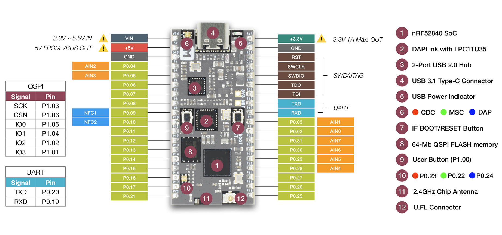

# Grove Mesh Kit for nRF52840-MDK

> Build Mesh network with nRF52840-MDK and Grove

## Description

Grove Mesh Kit for nRF52840-MDK is a very versatile mesh networking development kit. It integrates [nRF52840-MDK](https://wiki.makerdiary.com/nrf52840-mdk/) development board, [Base Dock](https://wiki.makerdiary.com/base-dock/) and [SeeedStudio](https://www.seeedstudio.com/)’s most popular and easy-to-use [Grove Modules](https://www.seeedstudio.com/grove.html).

Grove Mesh Kit takes a full advantage of the multiprotocol capabilities of the nRF52840 SoC by supporting [Bluetooth Mesh](https://wiki.makerdiary.com/grove-mesh-kit/bluetooth-mesh) and [OpenThread Mesh](https://wiki.makerdiary.com/grove-mesh-kit/openthread-mesh) networking. It allows developers to create IoT applications with Mesh Network Connectivity in a very short time.

## Features

The key features of the Grove Mesh Kit are:

* nRF52840 Micro Development Kit(nRF52840-MDK)
	* nRF52840 Advanced Bluetooth 5, Thread and Zigbee multiprotocol SoC
	* Program/Debug options with DAPLink
	* Microchip 2-Port USB 2.0 Hi-Speed Hub Controller
	* External ultra-low power 64-Mb QSPI FLASH memory
	* On-board 2.4G chip antenna
	* U.FL connector selectable for external antenna
	* Reversible USB 3.1 Type-C Connector
	* Buttons and LEDs for user interaction
	* Up to 24 GPIOs available via headers

* Base Dock (Grove Compatible)
	* Dual 2x18 Socket Headers
	* 4 Grove connectors with UART/I2C/I2S/PDM/QDEC/SPI/ADC selectable
	* Supporting NFC-A Listen Mode with PCB NFC Antenna
	* AA Battery power supply
	* Power Button with Latching Circuit
	* Battery level sensing

* 6 easy-to-use Grove modules
	* Grove - Button
	* Grove - Light Sensor
	* Grove - Rotary Angle Sensor
	* Grove - Sound Sensor
	* Grove - Temperature Sensor
	* Grove - Touch Sensor

## Block Diagram

## Included in the Box

* [nRF52840 Micro Development Kit (nRF52840-MDK)](https://wiki.makerdiary.com/nrf52840-mdk/)
* [Base Dock (Grove Compatible)](https://wiki.makerdiary.com/base-dock/)
* [Grove - Button](https://www.seeedstudio.com/category/Grove-c-1003/category/Input-c-21/buttons-c-928/Grove-Button.html)
* [Grove - Light Sensor](https://www.seeedstudio.com/Grove-Light-Sensor-v1-2.html)
* [Grove - Rotary Angle Sensor](https://www.seeedstudio.com/Grove-Rotary-Angle-Sensor.html)
* [Grove - Sound Sensor](https://www.seeedstudio.com/Grove-Sound-Sensor.html)
* [Grove - Temperature Sensor](https://www.seeedstudio.com/Grove-Temperature-Sensor.html)
* [Grove - Touch Sensor](https://www.seeedstudio.com/Grove-Touch-Sensor.html)

## Tutorials

We think the best way to learn is by doing. And to help you get started, we have provided a series of tutorials. Find the details below.

* [Getting Started with Grove Mesh Kit](https://wiki.makerdiary.com/grove-mesh-kit/getting-started)
* [Grove Mesh Kit with nRF5 SDK](https://wiki.makerdiary.com/grove-mesh-kit/setting-up-nrf5-sdk)
* [Bluetooth Mesh Networking](https://wiki.makerdiary.com/grove-mesh-kit/bluetooth-mesh)
* [OpenThread Mesh Networking](https://wiki.makerdiary.com/grove-mesh-kit/openthread-mesh)

## Where to Buy

Grove Mesh Kit is available at [Seeed Studio](https://www.seeedstudio.com/) (click to go directly to the product):

## Contributing

We would love for you to contribute to this project and help make it even better than it is today! See our [Contributing Guidelines](https://wiki.makerdiary.com/grove-mesh-kit/CONTRIBUTING) for more information.

## License

**MIT License**

Copyright (c) 2019 [makerdiary.com](https://makerdiary.com)

Permission is hereby granted, free of charge, to any person obtaining a copy
of this software and associated documentation files (the "Software"), to deal
in the Software without restriction, including without limitation the rights
to use, copy, modify, merge, publish, distribute, sublicense, and/or sell
copies of the Software, and to permit persons to whom the Software is
furnished to do so, subject to the following conditions:

The above copyright notice and this permission notice shall be included in all
copies or substantial portions of the Software.

THE SOFTWARE IS PROVIDED "AS IS", WITHOUT WARRANTY OF ANY KIND, EXPRESS OR
IMPLIED, INCLUDING BUT NOT LIMITED TO THE WARRANTIES OF MERCHANTABILITY,
FITNESS FOR A PARTICULAR PURPOSE AND NONINFRINGEMENT. IN NO EVENT SHALL THE
AUTHORS OR COPYRIGHT HOLDERS BE LIABLE FOR ANY CLAIM, DAMAGES OR OTHER
LIABILITY, WHETHER IN AN ACTION OF CONTRACT, TORT OR OTHERWISE, ARISING FROM,
OUT OF OR IN CONNECTION WITH THE SOFTWARE OR THE USE OR OTHER DEALINGS IN THE
SOFTWARE.
