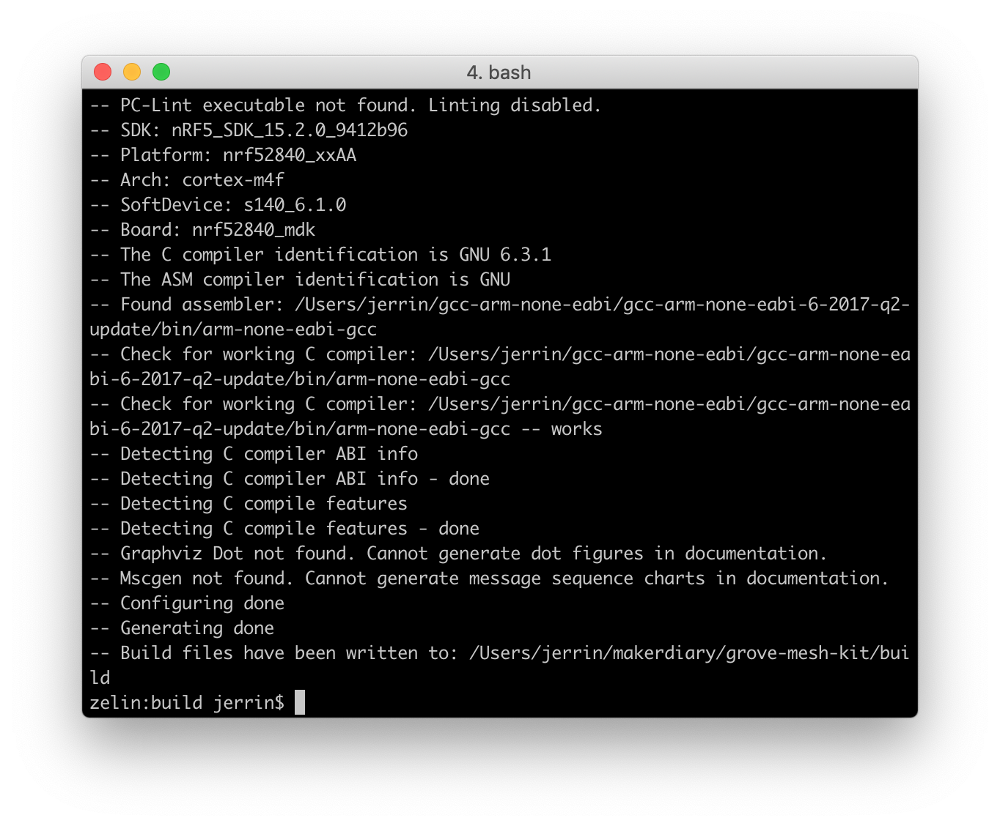
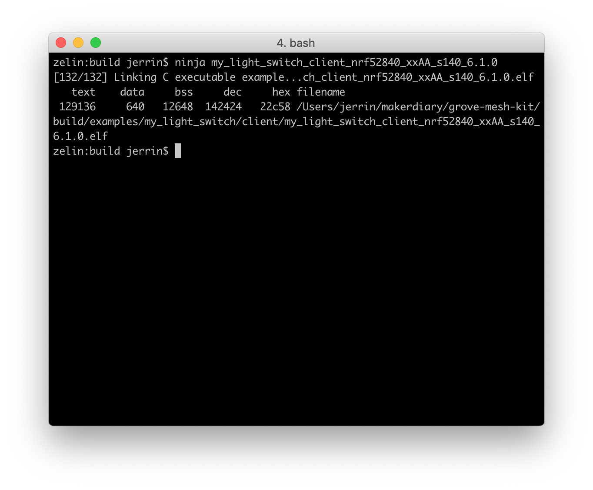
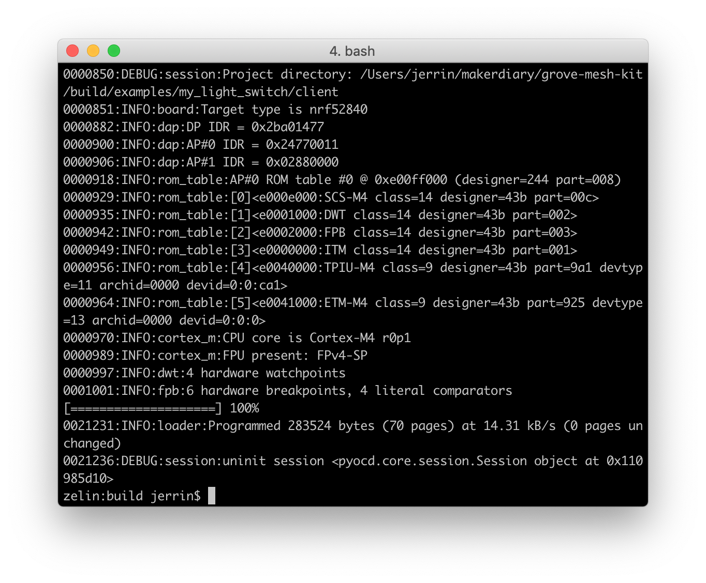
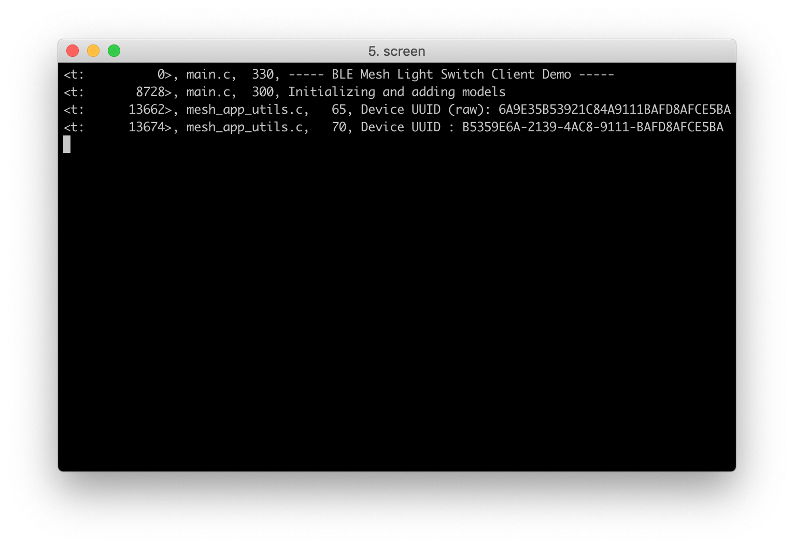
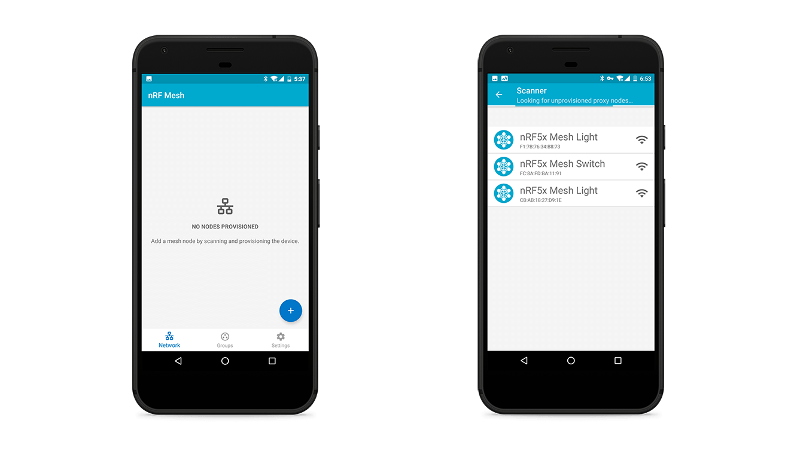

# Building and Running the Mesh examples

This section describes how to build the mesh library and example applications with *CMake*, and the run [my light switch](https://github.com/makerdiary/nRF5-SDK-for-Mesh/tree/master/examples/my_light_switch) example. 

Before you start building, remember to set up the mesh development environment first. See [Setting Up the Mesh SDK](../setting-up-the-mesh-sdk) for details.

## Generating build files

Good practice is to create a `build` folder in the `grove-mesh-kit` directory, where all artifacts generated by the Ninja build system are stored:

Open terminal and change directory to:

``` sh
cd ./grove-mesh-kit
```

Creat a `build` folder and change directory to it:
``` sh
mkdir build && cd build
```
Before you can build with Ninja, you must generate the correct build files with CMake.

``` sh
cmake -G Ninja -DTOOLCHAIN=gccarmemb -DPLATFORM=nrf52840_xxAA -DBOARD=nrf52840_mdk -DFLASHER=pyocd ../nrf_sdks/nRF5-SDK-for-Mesh/
```



## Building the stack and examples

After the Ninja build files are generated, running `ninja <target>` to build the targets. Here we take the target `my_light_switch_client` as an example:

``` sh
ninja my_light_switch_client_nrf52840_xxAA_s140_6.1.0
```


Other targets are ready for building. For example:
``` sh
ninja my_light_switch_server_nrf52840_xxAA_s140_6.1.0
```
``` sh
ninja my_light_switch_provisioner_nrf52840_xxAA_s140_6.1.0
```

## Running the example
To run examples on your nRF52840-MDK, first connect it to your computer with a USB cable. When your board is detected, run `ninja flash_<your target>` to flash the example:

``` sh
ninja flash_my_light_switch_client_nrf52840_xxAA_s140_6.1.0
```


Run a terminal application like [PuTTY](https://www.chiark.greenend.org.uk/~sgtatham/putty/) or [screen](https://www.gnu.org/software/screen/manual/screen.html) to print the log information:

``` sh
screen /dev/cu.usbmodem141102 115200
```


Flash other nRF52840-MDK boards with *Server* target:
``` sh
ninja flash_my_light_switch_server_nrf52840_xxAA_s140_6.1.0
```

You can use the [nRF Mesh mobile app](https://www.nordicsemi.com/Software-and-Tools/Development-Tools/nRF-Mesh) to provision the *client* and *server* devices:

[](assets/images/nrf-mesh-scanning-devices.png)


## Next Steps
Congratulations! You may find your way around to build and run the mesh examples. And further more, you can [create your own targets](../creating-your-own-targets).


## Create an Issue

Interested in contributing to this project? Want to report a bug? Feel free to click here:

<a href="https://github.com/makerdiary/grove-mesh-kit/issues/new"><button data-md-color-primary="marsala"><i class="fa fa-github"></i> Create an Issue</button></a>


