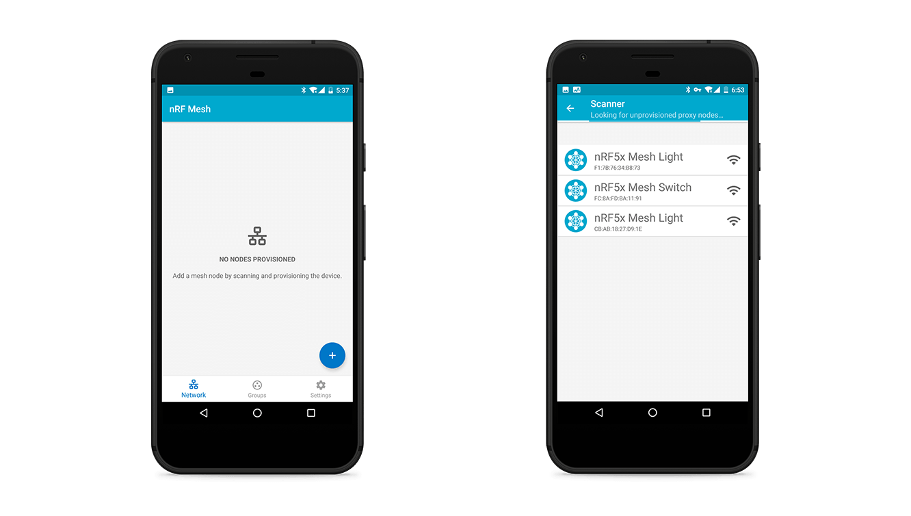
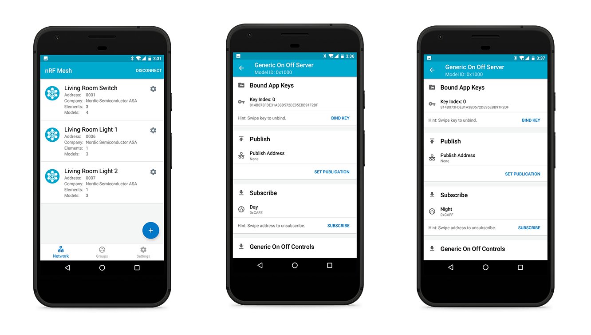

# Getting started with Bluetooth Mesh Network

This section describes how to quickly build a Bluetooth Mesh network using [my light switch](https://github.com/makerdiary/nRF5-SDK-for-Mesh/tree/master/examples/my_light_switch) example without going through the complete toolchain installation. 

There is no need to build any firmware for running it, as it uses the pre-built firmware of [my light switch](https://github.com/makerdiary/nRF5-SDK-for-Mesh/tree/master/examples/my_light_switch) example.

## Hardware Requirements

A minimal Bluetooth Mesh network requires at least One client, Two servers and One provisioner. Before starting to work, prepare the following parts:

* Grove Mesh Kit for nRF52840-MDK * 3
* Three AA batteries([Energizer® Ultimate Lithium™ AA battery](http://www.energizer.com/batteries/energizer-ultimate-lithium-batteries) is recommended to stay powered longer.)
* A phone with [nRF Mesh mobile app](https://www.nordicsemi.com/Software-and-Tools/Development-Tools/nRF-Mesh)([iOS](https://itunes.apple.com/us/app/nrf-connect/id1054362403?ls=1&mt=8) or [Android](https://play.google.com/store/apps/details?id=no.nordicsemi.android.mcp)) installed

## Assembling the hardware

1. Place the nRF52840-MDK board onto the Base Dock

2. Connect the Grove - Button to PORT#1 on the Base Dock

3. Attach the four plastic spacers supplied in your box to act as legs for the Base Dock

4. Insert an AA battery into the holder the right way around as marked on the board

!!! tip
    AA battery is NOT included in the kit. The [Energizer® Ultimate Lithium™ AA battery](http://www.energizer.com/batteries/energizer-ultimate-lithium-batteries) is recommended to stay powered longer.

## Flashing the example firmware

Before running [my light switch](https://github.com/makerdiary/nRF5-SDK-for-Mesh/tree/master/examples/my_light_switch) example, you need to flash the boards. The pre-built firmware is located in `grove-mesh-kit/firmware/bluetooth-mesh/my_light_switch`:

* For Client: *my_light_switch_client_nrf52840_xxAA_s140_6.1.0_merged.hex*
* For Servers: *my_light_switch_server_nrf52840_xxAA_s140_6.1.0_merged.hex*

!!! tip
    The provisioner firmware is not used here. The *nRF Mesh* app is used instead to provision the devices.

1. Connect one nRF52840-MDK board to your PC using the USB-C cable. A removable drive named **DAPLINK** will appear.
2. Drag and drop the pre-built *client* firmware into **DAPLINK**. After flashed, label the board **Client** so that later you don't confuse the board roles.
3. Program the rest two boards with the pre-build *server* firmware. And label them **Server#1** and **Server#2**.

!!! tip
	You can also program the board using [pyOCD](https://github.com/mbedmicro/pyOCD). Just follow this [tutorial](https://wiki.makerdiary.com/nrf52840-mdk/getting-started/#using-pyocd) to set up the pyOCD tool.

## Provisioning the devices

To participate in mesh communication, each device must be provisioned. Provisioning is the act of adding a device to a mesh network. Through the provisioning process, the new device receives a range of addresses, a network key, and a device key.

Here we use the [nRF Mesh mobile app](https://www.nordicsemi.com/Software-and-Tools/Development-Tools/nRF-Mesh) to provision the *client* and *server* devices:

1. Power up the client and servers
2. Launch the nRF Mesh mobile app. In *Network* tab, click <kbd>+</kbd> button to scan the devices. The client is recognized as `nRF5x Mesh Switch` and the servers are recognized as `nRF5x Mesh Light`.
    
3. Tap `nRF5x Mesh Switch`, and then go to the *Provisioning Data* configurations. Give the node a friendly name, such as `Living Room Switch`. Upon tapping *IDENTIFY*, the LED is blinking blue. Tap *PROVISION* and select *No OOB* type to finish provisioning.
    

4. Tap ⚙ to configure the `Living Room Switch`. You will see two *Generic On Off Client* elements. Bind them with the same app key. Set the publish address of the first *Generic On Off Client* to `0xCAFE` and the second one to `0xCAFF`. The publish addresses can be subscribed by the servers.
    

5. Tap `nRF5x Mesh Light` and go to the *Provisioning Data* configurations. Name the nodes `Living Room Light 1` and `Living Room Light 2`. Go ahead to finish provisioning.
	

6. Tap ⚙ to configure the `Living Room Light 1` and `Living Room Light 2`. Bind the `Generic On Off Server` with the same app key as the client. Set the subscribe address to the client's publish address `0xCAFE` or `0xCAFF`.
	

## Testing the mesh network
Now you have set up a Bluetooth mesh network with one client node and two server nodes. Try to press the buttons on the client to see the LEDs getting toggled on the associated servers.

## Next Steps

See the [Setting Up the Mesh SDK](../setting-up-the-mesh-sdk) section for information on environment setup. 

Once you set up your nRF5 SDK for Mesh environment, see the [Building & Running the examples](../building-n-running-the-examples) to build the examples on your own machine. And further more, you can [create your own targets](../creating-your-own-targets).

## Create an Issue

Interested in contributing to this project? Want to report a bug? Feel free to click here:

<a href="https://github.com/makerdiary/grove-mesh-kit/issues/new"><button data-md-color-primary="marsala"><i class="fa fa-github"></i> Create an Issue</button></a>

