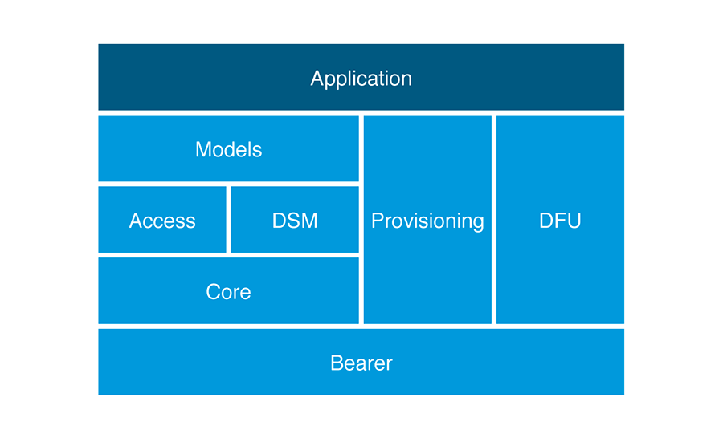

# Bluetooth Mesh Network for Grove Mesh Kit

## Overview

Mesh networking is a new topology available for Bluetooth Low Energy (BLE) devices that enables many-to-many (m:m) communications. It's optimized for creating large-scale node networks and is ideally suited for building automation, sensor networks, and asset tracking solutions.

The [Bluetooth Mesh Networking Specifications](https://www.bluetooth.com/specifications/mesh-specifications) are developed and published by the [Bluetooth SIG](https://www.bluetooth.com/). They include:

* **[Mesh Profile](https://www.bluetooth.org/docman/handlers/downloaddoc.ashx?doc_id=429633)**: Defines fundamental requirements to enable an interoperable mesh networking solution for Bluetooth LE wireless technology

* **[Mesh Model](https://www.bluetooth.org/docman/handlers/downloaddoc.ashx?doc_id=429634)**: Introduces *models*, used to define basic functionality of nodes on a mesh network

* **[Mesh Device Properties](https://www.bluetooth.org/docman/handlers/downloaddoc.ashx?doc_id=429635)**: Defines *device* properties required for the Mesh Model specification

More detailed information about Bluetooth Mesh is available in [Bluetooth SIG's introduction to Bluetooth Mesh](https://blog.bluetooth.com/introducing-bluetooth-mesh-networking) and the [Bluetooth Mesh Networking Specifications](https://www.bluetooth.com/specifications/mesh-specifications?_ga=2.18257471.723078495.1501226603-93769939.1480503530).

The [nRF5 SDK for Mesh](https://infocenter.nordicsemi.com/topic/struct_sdk/struct/sdk_mesh_latest.html) is Nordic Semiconductor's implementation of the Bluetooth Mesh. It allows applications to use the features provided by the Bluetooth Mesh when running on Nordic's nRF5 Series chips.

## Supported features

The nRF5 SDK for Mesh supports all the mandatory features of the Mesh Profile Specification. These mandatory features are qualified.

The following optional mesh features are supported by the nRF5 SDK for Mesh, but not qualified yet:

* Provisioning over GATT bearer
* GATT bearer
* Config client
* Mesh Proxy Service with Proxy Server
* Low Power feature
* Generic server and client models

## Resources

* [nRF5 SDK for Mesh Documentation](https://infocenter.nordicsemi.com/topic/struct_sdk/struct/sdk_mesh_latest.html)
* [Basic Bluetooth Mesh Concepts](https://infocenter.nordicsemi.com/topic/com.nordic.infocenter.meshsdk.v3.1.0/md_doc_introduction_basic_concepts.html)

* [nRF5 SDK for Mesh Architecture](https://infocenter.nordicsemi.com/topic/com.nordic.infocenter.meshsdk.v3.1.0/md_doc_introduction_basic_architecture.html)

## Create an Issue

Interested in contributing to this project? Want to report a bug? Feel free to click here:

<a href="https://github.com/makerdiary/grove-mesh-kit/issues/new"><button data-md-color-primary="marsala"><i class="fa fa-github"></i> Create an Issue</button></a>

