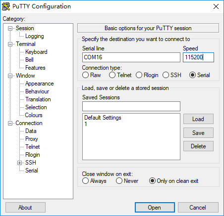

# Getting started with the Grove Mesh Kit

This guide describes how to start working with the Grove Mesh Kit in just a few minutes.


## Included in the Box

Your Grove Mesh Kit box includes the following parts:

* nRF52840 Micro Development Kit
* Base Dock (Grove Compatible)
* Grove - Button
* Grove - Light Sensor
* Grove Rotary Angle Sensor
* Grove - Sound Sensor
* Grove - Temperature Sensor
* Grove - Touch Sensor
* USB 3.1 Type-C Cable
* M3 Screws & Plastic Spacers

## Assemble the hardware

1. Place the nRF52840-MDK board onto the Base Dock

2. Connect the Grove modules to the Base Dock

3. Attach the four plastic spacers supplied in your box to act as legs for the Base Dock

4. Insert an AA battery into the holder the right way around as marked on the board

!!! tip
	AA battery is NOT included in the kit. The [Energizer® Ultimate Lithium™ AA battery](http://www.energizer.com/batteries/energizer-ultimate-lithium-batteries) is recommended to stay powered longer.


## Clone the repository

Clone the `grove-mesh-kit` repository from GitHub:

``` sh
git clone --recursive https://github.com/makerdiary/grove-mesh-kit
```

This repository provides documents and examples that you can run on your kit to ensure that everything is set up correctly.

## Run the Grove CLI example

To quickly explore the modules, run the [Grove CLI](https://github.com/makerdiary/grove-mesh-kit/tree/master/examples/grove_cli) example provided with the Grove Mesh Kit.
 
[Grove CLI](https://github.com/makerdiary/grove-mesh-kit/tree/master/examples/grove_cli) is a minimal application that exposes the Grove configuration and management interfaces via a basic command-line interface. This example source code is located in [examples/grove_cli](https://github.com/makerdiary/grove-mesh-kit/tree/master/examples/grove_cli).

### Flash the nRF52840-MDK

Follow these steps to flash the [Grove CLI](https://github.com/makerdiary/grove-mesh-kit/tree/master/examples/grove_cli/hex) pre-built firmware. 

1. Connect the nRF52840-MDK board to your PC using the USB-C cable.
2. Open a file explorer. Confirm that the board has appeared as a removable drive named **DAPLINK**. This allows you to program the nRF52840 chip. 
3. Drag and drop the pre-built firmware into **DAPLINK**. The Grove CLI pre-built firmware is located in `grove-mesh-kit/examples/grove_cli/hex`.


!!! tip
	You can also program the board using [pyOCD](https://github.com/mbedmicro/pyOCD). Just follow this [tutorial](https://wiki.makerdiary.com/nrf52840-mdk/getting-started/#using-pyocd) to set up the pyOCD tool.

### Explore the Grove modules

You can explore the Grove modules using a serial terminal like `screen` or [PuTTY](https://www.chiark.greenend.org.uk/~sgtatham/putty/latest.html). 

In Terminal, run:

``` sh
screen /dev/cu.usbmodem846fa1a9d0de1 115200
```

If you are using Windows OS, run the PuTTY application instead:



!!! tip
	Replace the serial port name `/dev/cu.usbmodem846fa1a9d0de1` or `COM16` with yours.

For your convenience, our [Web Device CLI](https://wiki.makerdiary.com/web-device-cli/) provides a Web Command Line Interface using Web Bluetooth. Here, we use the Web Device CLI to demonstrate the Grove CLI example. The commands should work similarly in your serial terminal.

1. Upon powering up the board with the USB or AA battery, the GREEN LED starts blinking. The device is advertising as *Grove CLI*.

2. Start the Web Device CLI by clicking the following link:

	<a href="https://wiki.makerdiary.com/web-device-cli/" target="_blank"><button data-md-color-primary="marsala" style="width: auto;">Start Web Device CLI</button></a>


3. Click the **Connect** button and pair the *Grove CLI* device.

4. Type `grove` and press the <kbd>Enter</kbd> button to see the hints.

	

5. Read the Grove - Rotary Angle Sensor connected to PORT#2 by running:

	``` sh
	grove angle -p 2
	```

	You will see the result like this:

	``` sh
	grove_cli:~$ grove angle -p 2
	ADC RAW: 629
	Angle: 201[degree]
	grove_cli:~$
	```

6. Read the Grove - Light Sensor connected to PORT#3 by running:

	``` sh
	grove light -p 3
	```

	The CLI outputs like this:

	``` sh
	grove_cli:~$ grove light -p 3
	ADC RAW: 27
	Voltage: 94[mV]
	grove_cli:~$
	```

7. Read the Grove - Sound Sensor connected to PORT#4 by running:

	``` sh
	grove sound -p 4
	```

	You will get the sound level:

	``` sh
	grove_cli:~$ grove sound -p 4
	Sound Level: 47[dB]
	grove_cli:~$ 
	```

8. Read the Grove - Temperature Sensor connected to PORT#2 by running:

	``` sh
	grove temp -p 2
	```

	You can get the ambient temperature:

	``` sh
	grove_cli:~$ grove temp -p 2
	ADC RAW: 493
	Temperature: 23.50[degreeC]
	grove_cli:~$ 
	```

9. Connnect the Grove - Button to PORT#1, then run:

	``` sh
	grove button enable -p 1
	```

	Press and release the button. The CLI outputs like this:

	``` sh
	grove_cli:~$ grove button enable -p 1
	Grove Button on Port1 Enabled
	grove_cli:~$ 
	Button on Port1: Pressed
	Button on Port1: Released
	```

10. Connect the Grove - Touch Sensor to PORT#2, and run:

	``` sh
	grove touch enable -p 2
	```

	Touch and release the touch pad. The CLI outputs like this:

	``` sh
	grove_cli:~$ grove touch enable -p 2
	Grove Touch on Port2 Enabled
	grove_cli:~$ 
	Touch on Port2: Touched
	Touch on Port2: Released
	```


## Next Steps

Congratulations! You may find your way around:

* Head to the [nRF5 SDK Tutorial Page](../setting-up-nrf5-sdk) for building an nRF5 SDK example like *Grove CLI*

* Check out the Mesh networking tutorials including:

	* [Bluetooth Mesh Network](../bluetooth-mesh/)
	* [OpenThread Mesh Network](../openthread-mesh/)

* Many more details about the kit hardware can be found here:

	* [nRF52840-MDK Documentation]()
	* [Base Dock Documentation](https://wiki.makerdiary.com/base-dock/)
	* [Grove Wiki](http://wiki.seeedstudio.com/Grove/)


## Create an Issue

Interested in contributing to this project? Want to report a bug? Feel free to click here:

<a href="https://github.com/makerdiary/grove-mesh-kit/issues/new"><button data-md-color-primary="marsala"><i class="fa fa-github"></i> Create an Issue</button></a>


