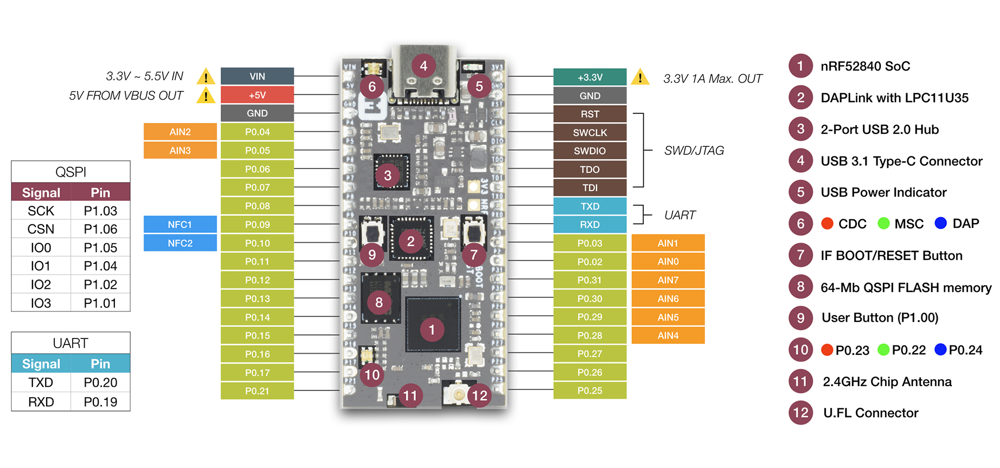

# Grove Mesh Kit for nRF52840-MDK  <small>Build Mesh network with nRF52840-MDK and Grove</small>

## Description

Grove Mesh Kit for nRF52840-MDK is a very versatile mesh networking development kit. It integrates [nRF52840-MDK](https://wiki.makerdiary.com/nrf52840-mdk/) development board, [Base Dock](https://wiki.makerdiary.com/base-dock/) and [SeeedStudio](https://www.seeedstudio.com/)’s most popular and easy-to-use [Grove Modules](https://www.seeedstudio.com/grove.html).

Grove Mesh Kit takes a full advantage of the multiprotocol capabilities of the nRF52840 SoC by supporting [Bluetooth Mesh](/bluetooth-mesh) and [OpenThread Mesh](/openthread-mesh) networking. It allows developers to create IoT applications with Mesh Network Connectivity in a very short time.

## Features

The key features of the Grove Mesh Kit are:

* nRF52840 Micro Development Kit(nRF52840-MDK)
	* nRF52840 Advanced Bluetooth 5, Thread and Zigbee multiprotocol SoC
	* Program/Debug options with DAPLink
	* Microchip 2-Port USB 2.0 Hi-Speed Hub Controller
	* External ultra-low power 64-Mb QSPI FLASH memory
	* On-board 2.4G chip antenna
	* U.FL connector selectable for external antenna
	* Reversible USB 3.1 Type-C Connector
	* Buttons and LEDs for user interaction
	* Up to 24 GPIOs available via headers

* Base Dock (Grove Compatible)
	* Dual 2x18 Socket Headers
	* 4 Grove connectors with UART/I2C/I2S/PDM/QDEC/SPI/ADC selectable
	* Supporting NFC-A Listen Mode with PCB NFC Antenna
	* AA Battery power supply
	* Power Button with Latching Circuit
	* Battery level sensing

* 6 easy-to-use Grove modules
	* Grove - Button
	* Grove - Light Sensor
	* Grove - Rotary Angle Sensor
	* Grove - Sound Sensor
	* Grove - Temperature Sensor
	* Grove - Touch Sensor

## Block Diagram

## Included in the Box

| **nRF52840 Micro Development Kit** | **Base Dock (Grove Compatible)** |
|:---:|:---:|
|  |  |

|  | **Grove Modules** |  |
|:---:|:---:|:---:|
|   [Grove - Button](https://www.seeedstudio.com/category/Grove-c-1003/category/Input-c-21/buttons-c-928/Grove-Button.html) |   [Grove - Light Sensor](https://www.seeedstudio.com/Grove-Light-Sensor-v1-2.html) |  [Grove - Rotary Angle Sensor](https://www.seeedstudio.com/Grove-Rotary-Angle-Sensor.html)|
|  [Grove - Sound Sensor](https://www.seeedstudio.com/Grove-Sound-Sensor.html) |  [Grove - Temperature Sensor](https://www.seeedstudio.com/Grove-Temperature-Sensor.html) |  [Grove - Touch Sensor](https://www.seeedstudio.com/Grove-Touch-Sensor.html)|

## Tutorials

We think the best way to learn is by doing. And to help you get started, we have provided a series of tutorials. Find the details below.

* [Getting Started with Grove Mesh Kit](/getting-started)
* [Grove Mesh Kit with nRF5 SDK](/setting-up-nrf5-sdk)
* [Bluetooth Mesh Networking](/bluetooth-mesh)
* [OpenThread Mesh Networking](/openthread-mesh)

## Create an Issue

Interested in contributing to this project? Want to report a bug? Feel free to click here:

<a href="https://github.com/makerdiary/grove-mesh-kit/issues/new"><button data-md-color-primary="marsala"><i class="fa fa-github"></i> Create an Issue</button></a>

