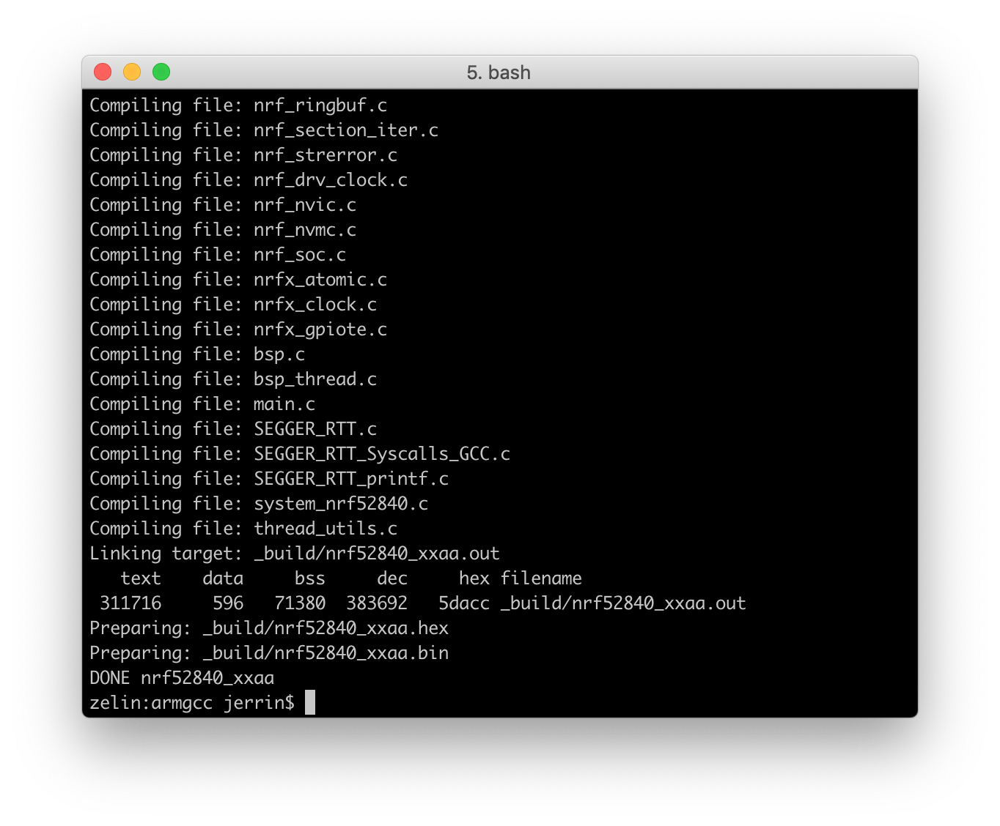
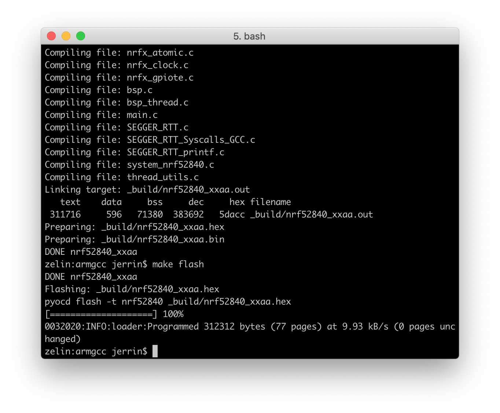
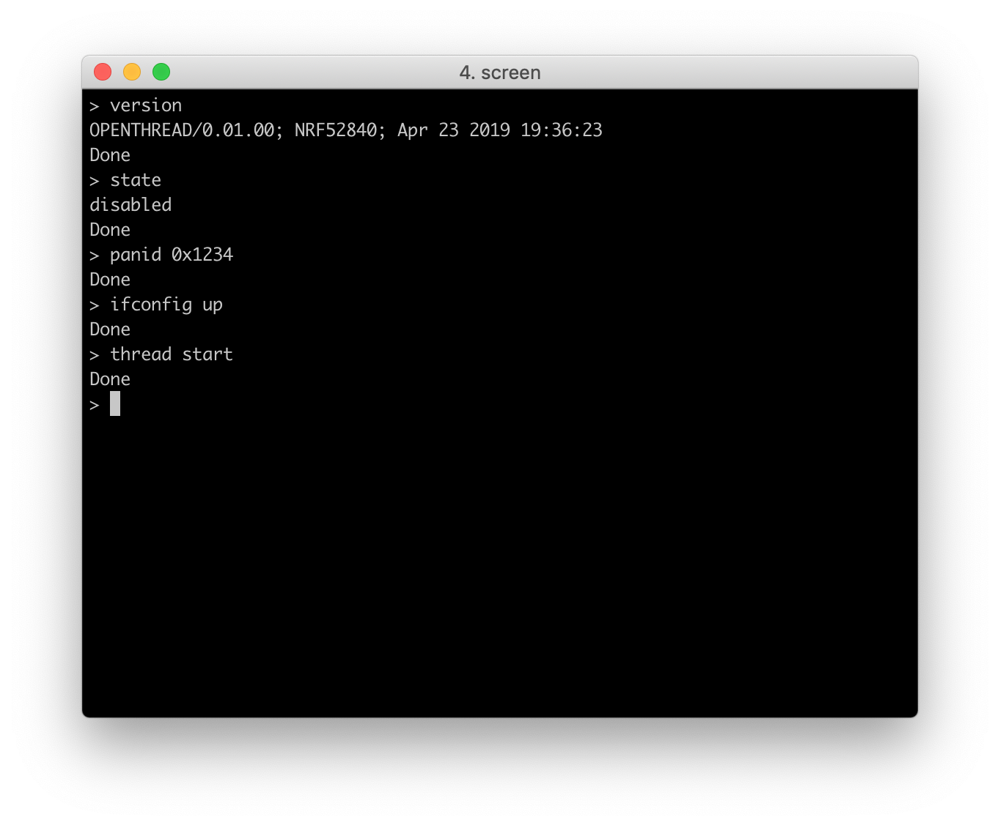

# Building and Running the OpenThread examples

This section describes how to build the OpenThread library and example applications with the nRF5 SDK for Thread.

Before you start building, remember to set up the Thread development environment first. See [Setting Up the Thread SDK](../setting-up-the-thread-sdk) for details.

## Build the OpenThread libraries

Before building the OpenThread examples, you first need to build the OpenThread libraries.

1. Open terminal and change directory to:
	``` sh
	cd ./grove-mesh-kit/deps/openthread
	```

2. To install the dependencies, run:
	``` sh
	./bootstrap
	```

3. Always clean the repo of previous builds first by running `make clean`:
	``` sh
	make -f examples/Makefile-nrf52840 clean
	```

4. For **UART transport**, run the following command. This allows you to communicate with the nRF52840 chip over UART interface.
	``` sh
	make -f examples/Makefile-nrf52840 BORDER_AGENT=1 BORDER_ROUTER=1 COAP=1 COMMISSIONER=1 DNS_CLIENT=1 JOINER=1 LINK_RAW=1 MAC_FILTER=1 MTD_NETDIAG=1 SERVICE=1 UDP_FORWARD=1 ECDSA=1 SNTP_CLIENT=1 COAPS=1
	```

5. Alternatively, if you want to use the **USB transport**, run the command below:
	``` sh
	make -f examples/Makefile-nrf52840 BORDER_AGENT=1 BORDER_ROUTER=1 COAP=1 COMMISSIONER=1 DNS_CLIENT=1 JOINER=1 LINK_RAW=1 MAC_FILTER=1 MTD_NETDIAG=1 SERVICE=1 UDP_FORWARD=1 ECDSA=1 SNTP_CLIENT=1 COAPS=1 USB=1
	```

## Build the OpenThread CLI
Now it's ready to build the OpenThread CLI example. The example is located in `grove-mesh-kit/examples/thread/cli`. 

Navigate to the directory with the OpenThread Full Thread Device (FTD) CLI Makefile:

``` sh
cd ./grove-mesh-kit/examples/thread/cli/ftd/uart/armgcc
```

Run `make` to build the example:

``` sh
make
```



## Run the OpenThread CLI
To run the OpenThread CLI on your nRF52840-MDK, first connect it to your computer with a USB cable. When your board is detected, run `make flash` to flash the example:

``` sh
make flash
```



Run a terminal application like [PuTTY](https://www.chiark.greenend.org.uk/~sgtatham/putty/) or [screen](https://www.gnu.org/software/screen/manual/screen.html) to configure the device:

``` sh
screen /dev/cu.usbmodem141102 115200
```



Program the rest boards by repeating steps as described above. To test the example, follow the [Running the OpenThread CLI](../getting-started/#running-the-openthread-cli) section.

## Next Steps

You can check out other Thread examples located in `grove-mesh-kit/examples/thread`. And further more, you can follow the tutorials to [Build an OpenThread Border Router with Raspberry Pi](../openthread-border-router), or [Make an OpenThread Network Sniffer](../thread-network-sniffer) to sniff packets on a Thread network.

## Create an Issue

Interested in contributing to this project? Want to report a bug? Feel free to click here:

<a href="https://github.com/makerdiary/grove-mesh-kit/issues/new"><button data-md-color-primary="marsala"><i class="fa fa-github"></i> Create an Issue</button></a>


