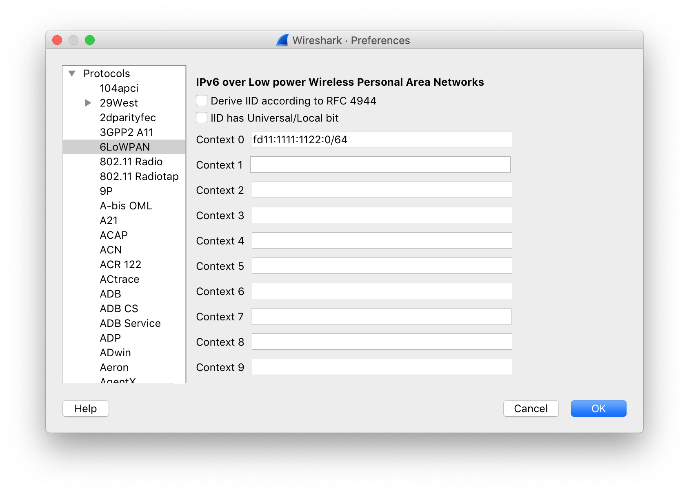
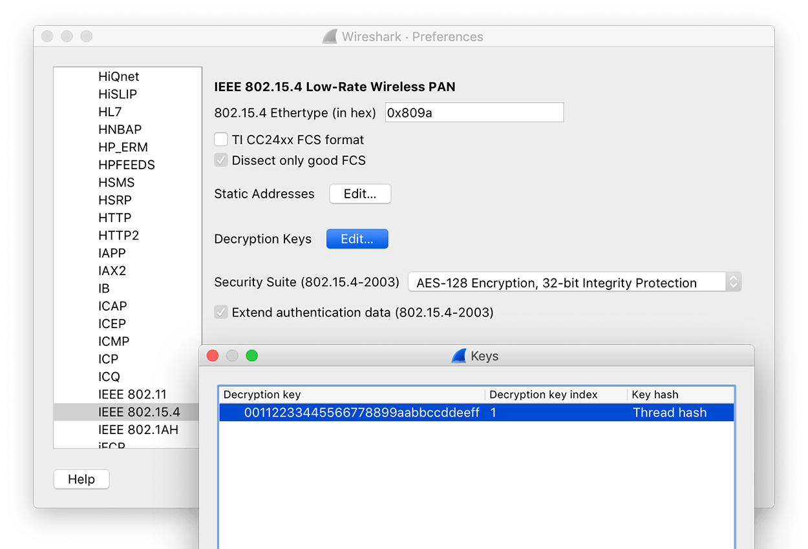
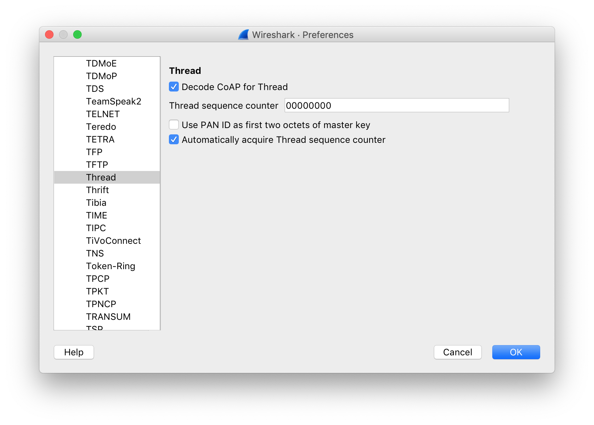
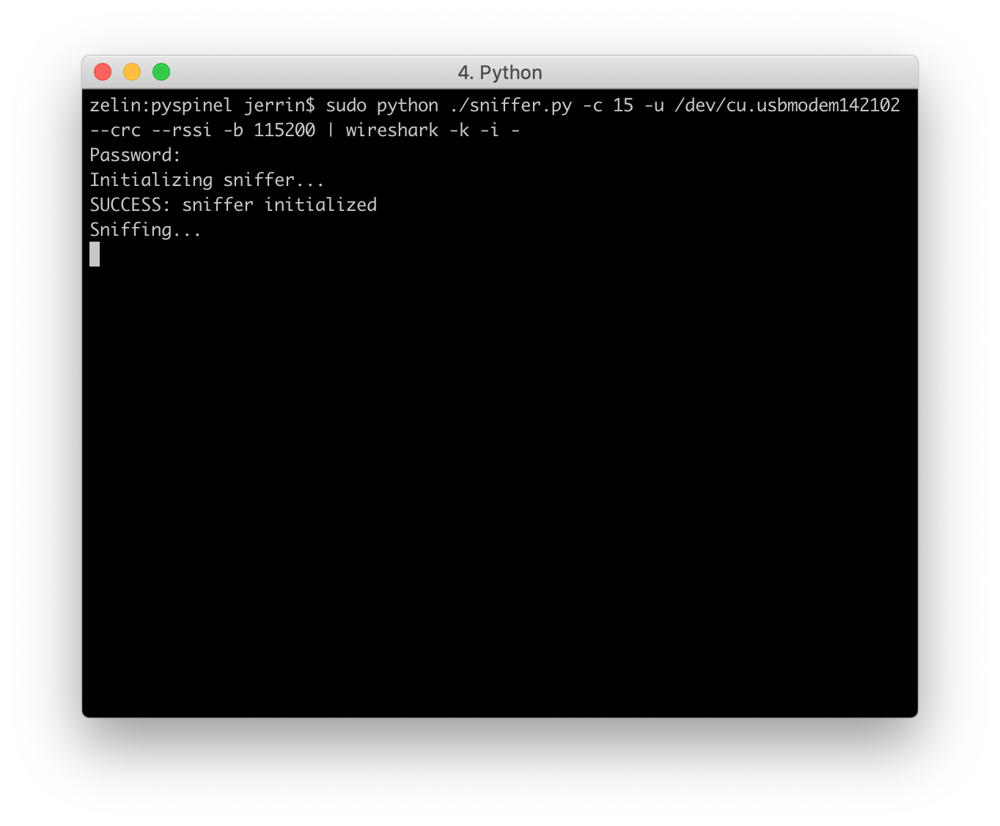
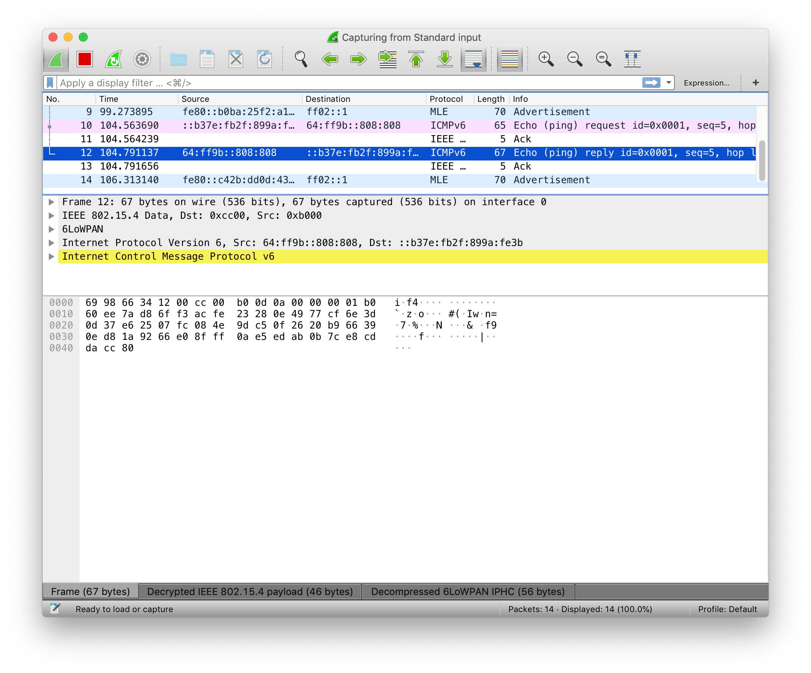

# Build a Thread Network Sniffer

## Overivew

During development, you may need to check what kind of data is wirelessly transmitted over the Thread network. With [Pyspinel](https://github.com/openthread/pyspinel) and Wireshark, you can set up a sniffer which allows to dynamically monitor the IEEE 802.15.4 wireless traffic. 

The Pyspinel sniffer tool connects to a Thread NCP device and converts it into a promiscuous packet sniffer, generating a pcap (packet capture) stream to be saved or piped directly into Wireshark.

Wireshark is an open-source tool that can decode network protocols in the Thread stack, such as IEEE 802.15.4, 6LoWPAN, IPv6, MLE (Mesh Link Establishment), UDP, and CoAP.


This section describes how to set up a Thread Sniffer, which can help you to efficiently analyze Thread network traffic.


## Requirements

* macOS or Ubuntu machine
* A Grove Mesh Kit for nRF52840-MDK
* [Python 2.7 or Python 3](https://www.python.org/downloads/)
* [Wireshark](https://wireshark.org/) 2.4.1 or newer

## Installation

### Set up the sniffer environment

Clone and install Pyspinel and dependencies:

``` sh
git clone https://github.com/openthread/pyspinel
cd pyspinel
pip install --user future pyserial ipaddress
```

### Install Wireshark

On MacOS, go to the [Wireshark Download page](https://www.wireshark.org/#download) and install the current stable release of Wireshark.

On Ubuntu Linux, you can run the following commands:

``` sh
$ sudo add-apt-repository ppa:wireshark-dev/stable
$ sudo apt-get update
$ sudo apt-get install wireshark
```

## Flash the NCP Radio firmware

The pre-built firmware is located in `grove-mesh-kit/firmware/openthread/ncp`. Follow these steps to flash the pre-built NCP Radio firmware:

1. Connect one nRF52840-MDK board to your PC using the USB-C cable. 

2. Open a file explorer. Confirm that the board has appeared as a removable drive named **DAPLINK**. This allows you to program the nRF52840 chip. 

3. Drag and drop the pre-built NCP Radio firmware `thread_ncp_radio_uart_nrf52840_mdk.hex` into **DAPLINK**. 

!!! tip
	You can also program the board using [pyOCD](https://github.com/mbedmicro/pyOCD). Just follow this [tutorial](https://wiki.makerdiary.com/nrf52840-mdk/getting-started/#using-pyocd) to set up the pyOCD tool.

## Thread network properties

Before continuing, get the following properties for the Thread network you wish to sniff. You'll need them for Wireshark configuration and running the Pyspinel sniffer.

### Mesh Local Prefix

To get the Mesh Local Prefix from a device in the target Thread network:

1. Using the OpenThread CLI:

	``` sh
	> dataset active
	Active Timestamp: 0
	Channel: 15
	Channel Mask: 07fff800
	Ext PAN ID: 1111111122222222
	Mesh Local Prefix: fd11:1111:1122:0/64
	Master Key: 00112233445566778899aabbccddeeff
	Network Name: OpenThreadDemo
	PAN ID: 0x1234
	PSKc: 61e1206d2c2b46e079eb775f41fc7219
	Security Policy: 672, onrcb
	Done
	```

2. Using `wpanctl` with an NCP:

	``` sh
	$ sudo wpanctl getprop IPv6:MeshLocalPrefix
	IPv6:MeshLocalPrefix = "fd11:1111:1122::/64"
	```

3. Using the OTBR Web GUI, select **Status**. The Mesh Local Prefix is listed as IPv6:MeshLocalPrefix similar to `wpanctl`.

### Channel

To get the Channel from a device in the target Thread network:

1. Using the OpenThread CLI:

	``` sh
	> channel
	15
	Done
	```

2. Using `wpanctl` with an NCP:

	``` sh
	$ sudo wpanctl getprop NCP:Channel
	NCP:Channel = 15
	```

3. Using the OTBR Web GUI, select **Status**. The Channel is listed as NCP:Channel similar to `wpanctl`.

### Master Key

The Thread network Master Key is used by Wireshark to decrypt packets after capture. To get the Master Key from a device in the target Thread network:

1. Using the OpenThread CLI:

	``` sh
	> masterkey
	00112233445566778899aabbccddeeff
	Done
	```

2. Using `wpanctl` with an NCP:

	``` sh
	$ sudo wpanctl getprop Network:Key
	Network:Key = [00112233445566778899AABBCCDDEEFF]
	```

!!! note
	The Thread network Master Key is not available in the OTBR Web GUI.


## Wireshark configuration - protocols

Wireshark must be configured to properly show Thread packets.

Select **Preferences...** in Wireshark and expand the **Protocols** section.

### 6LoWPAN

Select **6LoWPAN** from the list of protocols and verify or change the following settings:

1. Uncheck **Derive ID according to RFC 4944**.
2. Update **Context 0** with the Mesh Local Prefix for the target Thread network.

Wireshark uses context configurations to parse the compressed IPv6 address and display the IPv6 source and destination addresses correctly.



### CoAP

Select **CoAP** from the list of protocols and set **CoAP UDP Port** to `61631`. This ensures TMF messages (like address solicit) are displayed.

### IEEE 802.15.4

Select **IEEE 802.15.4** from the list of protocols and verify or change the following settings:

1. Set **802.15.4 Ethertype (in hex)** to `0x809a`.

2. Set the **Security Suite (802.15.4-2003)** to `AES-128 Encryption, 32-bit Integrity Protection`.

3. Click the <kbd>Edit...</kbd> button next to **Decryption Keys**, which is where you add the Thread network Master Key for packet decryption.

	a. Click <kbd>+</kbd> to add a **Decryption key**.

	b. Enter the Thread network Master Key into the **Decryption key** column.

	c Enter `1` as the **Decryption key index**.

	d. Select **Thread hash** from the **Key hash** column listbox. 

	e. Click <kbd>OK</kbd> to save the decryption key.

	

### Thread

Select **Thread** from the list of protocols and verify or change the following settings:

1. Enter `00000000` for the **Thread sequence counter**.

2. Uncheck **Use PAN ID as first two octets of master key**.

3. Check **Automatically acquire Thread sequence counter**.

Click the <kbd>OK</kbd> button to save any protocol changes.



!!! note
	Some Thread traffic might be analyzed as the ZigBee protocol. To correctly display these two protocols, edit the enabled protocols in Wireshark:
	
	1. In Wireshark, go to **Analyze** > **Enabled Protocols**.
		
	2. Uncheck the following protocols:
		* LwMesh
		* ZigBee
		* ZigBee Green Power

## Wireshark configuration - RSSI

To display RSSI in Wireshark:

1. Go to **Preferences** > **Protocols** > **IEEE 802.15.4**.
2. Check **TI CC24xx FCS format**.
3. Click <kbd>OK</kbd> to save and return to the **Preferences** menu.
4. From **Preferences**, select **Appearance** > **Columns**.
5. Add a new entry:
	* Title: RSSI
	* Type: Custom
	* Fields: wpan.rssi

## Run the sniffer

Make sure to use the specific device path for your NCP and the channel for the Thread network you are attempting to sniff.

Change to the `pyspinel` directory and start Wireshark with the following command:

``` sh
sudo python ./sniffer.py -c 15 -u /dev/cu.usbmodem142102 --crc --rssi -b 115200 | wireshark -k -i -
```

The parameters stand for the following:

* `-c`: Thread Channel
* `-u`: The NCP device path
* `–crc`: Disable the wrong FCS warning resulting from the fact that Nordic radio replaces one byte of CRC with LQI after a packet is received and verified.
* `--rssi`: Ensure the RSSI is included in the pcap output.
* `-b`: Baud rate

You should now be able to see the packets and related protocols for this configuration in Wireshark:






## Reference

For more information on how to use Pyspinel and Wireshark, see the following:

* [Spinel sniffer reference](https://github.com/openthread/pyspinel/blob/master/SNIFFER.md)
* [wireshark.org](https://www.wireshark.org/)
* [openthread.io - Packet sniffing with Pyspinel](https://openthread.io/guides/ncp/sniffer)

## License

Portions of this page are reproduced from work created and [shared by Google](https://developers.google.com/readme/policies/) and used according to terms described in the [Creative Commons 3.0 Attribution License](https://creativecommons.org/licenses/by/3.0/).

Thread is a registered trademark of the Thread Group, Inc.


## Create an Issue

Interested in contributing to this project? Want to report a bug? Feel free to click here:

<a href="https://github.com/makerdiary/grove-mesh-kit/issues/new"><button data-md-color-primary="marsala"><i class="fa fa-github"></i> Create an Issue</button></a>


