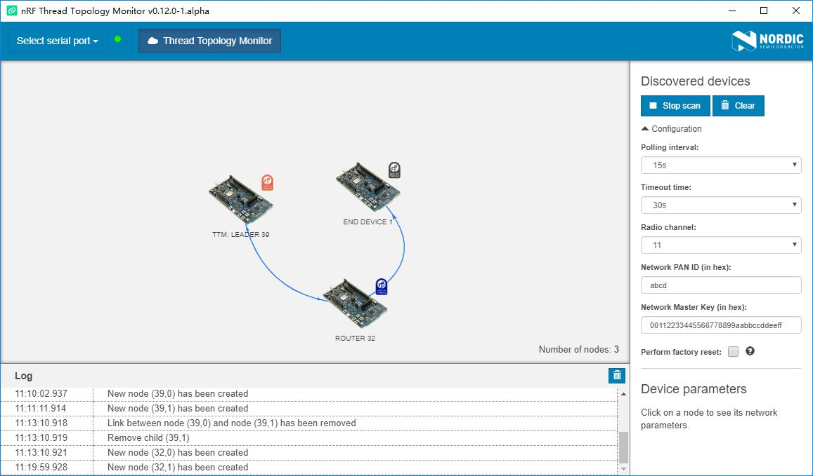

# Thread Topology Monitor

This section describes how to set up the nRF Thread Topology Monitor to visualize the current network topology.

## Introduction

nRF Thread Topology Monitor is a cross-platform tool that enables developers to visualize Thread mesh network topology in real time. The tool is supported on Windows and Linux with separate downloads for each platform. It requires a serial connection to an nRF52840 board with Nordic’s Thread solution.

nRF Thread Topology Monitor uses diagnostic mechanisms of the Thread protocol to retrieve information about routing tables of each Thread Router currently attached to the network. The tool also allows to identify a particular device in the network using LEDs by interacting with the Thread BSP solution. You may assign a custom label to a Thread node and store it in persistent memory on the PC side, which helps to track topology changes.

## Installation

1. Navigate to [nRF Thread Topology Monitor](https://www.nordicsemi.com/Software-and-Tools/Development-Tools/nRF-Thread-topology-monitor/Download#infotabs) page and download one of the following packages:
	* Windows: nRF_TTM-win32-x64_v0.12.0-1.alpha
	* Linux: nRF_TTM-linux-x64_v0.12.0-1.alpha.tar.gz

2. Extract the package.

3. Run the nRF Thread Topology Monitor executable file `nRF_TTM`.

## Flashing the OpenThread CLI

nRF Thread Topology Monitor requires [OpenThread CLI] firmware running on your board. Follow these steps to flash the [OpenThread CLI](https://github.com/makerdiary/grove-mesh-kit/tree/master/firmware/openthread/cli) pre-built firmware. 

1. Connect the nRF52840-MDK board to your PC using the USB-C cable.
2. Open a file explorer. Confirm that the board has appeared as a removable drive named **DAPLINK**. This allows you to program the nRF52840 chip. 
3. Drag and drop the pre-built firmware into **DAPLINK**. The OpenThread CLI pre-built firmware is located in `grove-mesh-kit/firmware/openthread/cli`.

!!! tip
	You can also program the board using [pyOCD](https://github.com/mbedmicro/pyOCD). Just follow this [tutorial](https://wiki.makerdiary.com/nrf52840-mdk/getting-started/#using-pyocd) to set up the pyOCD tool.

## Viewing network topology

The following steps will show you how to set up the nRF Thread Topology Monitor:

1. Connect the board to your PC using the USB-C cable.
2. In the navigation bar, click **Select serial port**.
3. Click the **Show all** button in the dropdown menu and select the serial port.
4. Click **Start scan** to attach the nRF SoC to the Thread network and to start polling nodes to get information on the current topology. 
5. Try to attach other Thread devices to the network. The nRF Thread Topology Monitor will visualize them as shown in the figure below.

!!! tip
	During the device configuration, you can specify the parameters of the Thread Network: **Radio channel**, **Network PAN ID**, **Network Master Key**.

## Reference

* [nRF Thread Topology Monitor Product Page](https://www.nordicsemi.com/Software-and-Tools/Development-Tools/nRF-Thread-topology-monitor)
* [nRF Thread Topology Monitor Documentation](https://infocenter.nordicsemi.com/topic/com.nordic.infocenter.thread_zigbee.v3.0.0/thread_topology_monitor.html)

## Create an Issue

Interested in contributing to this project? Want to report a bug? Feel free to click here:

<a href="https://github.com/makerdiary/grove-mesh-kit/issues/new"><button data-md-color-primary="marsala"><i class="fa fa-github"></i> Create an Issue</button></a>

