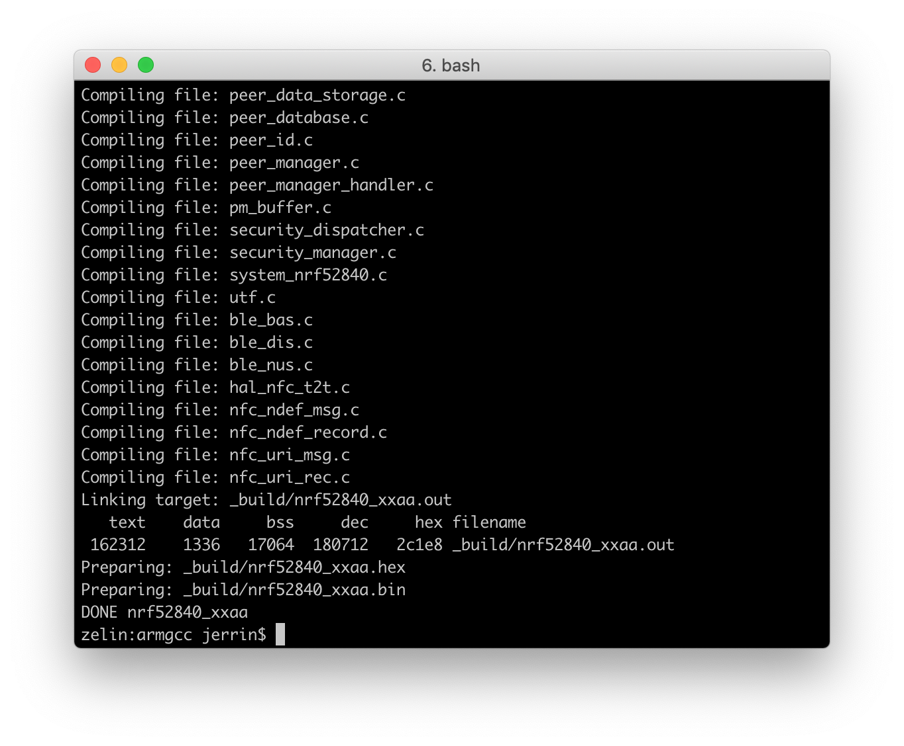
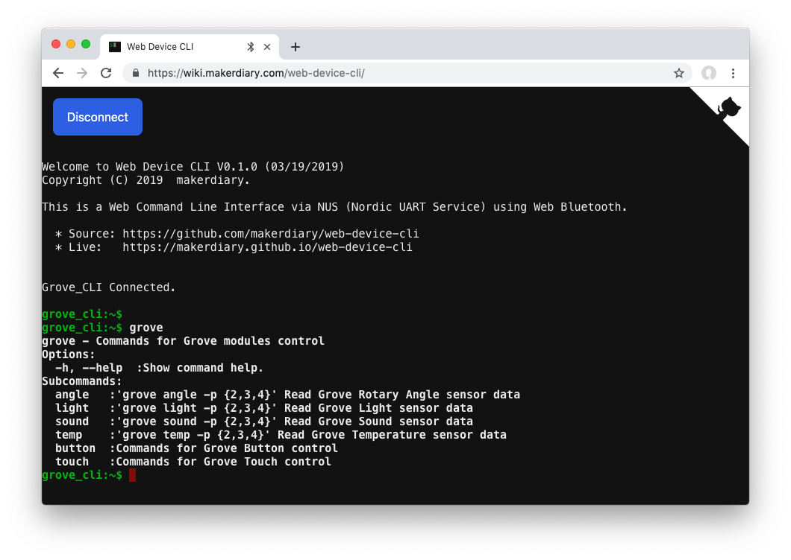

# nRF5 SDK <br><small>Offical Software Development Kit for nRF51 and nRF52 Series</small>

[](https://www.nordicsemi.com/Software-and-Tools/Software/nRF5-SDK/)

## Overview

The nRF5 SDK is your first stop for building fully featured, reliable and secure applications with the nRF52 and nRF51 Series. It offers developers a wealth of varied modules and examples right across the spectrum including numerous Bluetooth Low Energy profiles, Device Firmware Upgrade (DFU), GATT serializer and driver support for all peripherals on all nRF5 Series devices. The nRF5 SDK will almost certainly have something for your needs in developing exciting yet robust wireless products.

Follow this guide to set up a nRF5 SDK development environment on your system, and then build and run a sample application.


## Set up the toolchain

To build the nRF5 SDK examples, GNU ARM Embedded Toolchain is required. Follow one of the following guides for your host operating system:

* [macOS](#macos)
* [Windows](#windows)
* [Linux](#linux)

### macOS

1. GNU make is bundled with Xcode tools. Verify by running:
	``` sh
	make --v
	```

2. Download and install the [GNU ARM Embedded Toolchain](https://developer.arm.com/open-source/gnu-toolchain/gnu-rm/downloads). The `6-2017-q2-update` version is recommended. Then ensure the path is added to your OS PATH environment variable.

    ``` sh
    # in ~/.bash_profile, add the following script
    export PATH="<path to install directory>/gcc-arm-none-eabi-6-2017-q2-update/bin:${PATH}"
    ```
    Type the following in your terminal to verify if the path is set correctly:

    ``` sh
    arm-none-eabi-gcc --version
    ```

3. Download the [nRF5x-Command-Line-Tools-OSX](https://www.nordicsemi.com/Software-and-Tools/Development-Tools/nRF5-Command-Line-Tools/Download#infotabs), then extract the `.tar` archive anywhere on your filesystem. Ensure the extracted directory is added to your OS PATH environment variable.

    ``` sh
    # in ~/.bash_profile, add the following script
    export PATH="<the path to the extracted directory>:${PATH}"
    ```

    Type the following in your terminal to verify if `mergehex` works:
    ``` sh
    mergehex --version
    ```

4. Install the latest stable version of [pyOCD](https://github.com/mbedmicro/pyOCD) via `pip` as follows:

	``` sh
	pip install -U pyocd
	```

	Type the following in your terminal to verify if `pyocd` works:
	``` sh
	pyocd --version
	```

### Windows

On Windows the easiest way to install the dependencies is to use the [MSYS2](http://www.msys2.org/). You can do so by performing the following steps:

1. Download and run the installer - "x86_64" for 64-bit, "i686" for 32-bit Windows.
	<a href="http://www.msys2.org/"><button data-md-color-primary="marsala">Download</button></a>

2. Start MSYS2. Update the package database and core system packages with:

	``` sh
	pacman -Syu
	```

3. If needed, close MSYS2, run it again from Start menu. Update the rest with:

	``` sh
	pacman -Su
	```

4. Install dependencies:

	``` sh
	pacman -S git make python2
	```

5. Download and install the [GNU ARM Embedded Toolchain](https://developer.arm.com/open-source/gnu-toolchain/gnu-rm/downloads). The `6-2017-q2-update` version is recommended. Run the installer and follow the given instructions. Upon completion, check the *Add path to environment variable* option. Then verify if the compiler works:

    ``` sh
    arm-none-eabi-gcc --version
    ```

6. Download the [nRF5x-Command-Line-Tools for Win32](https://www.nordicsemi.com/Software-and-Tools/Development-Tools/nRF5-Command-Line-Tools/Download#infotabs). Run the installer and follow the given instructions. Then verify if `mergehex` works:

    ``` sh
    mergehex --version
    ```

7. Install the latest stable version of [pyOCD](https://github.com/mbedmicro/pyOCD) via `pip` as follows:

	``` sh
	pip install -U pyocd
	```
	Type the following in your terminal to verify if `pyocd` works:
	``` sh
	pyocd --version
	```

### Linux

This section describes how to set up the development environment on Ubuntu. The steps should be similar for other Linux distributions.

1. Ensure your host system is up to date before proceeding.

    ``` sh
    sudo apt-get update
    ```
    ``` sh
    sudo apt-get upgrade
    ```

2. Install the following packages using your system’s package manager.

    ``` sh
    sudo apt-get install build-essential checkinstall
    ```

3. Download and install the [GNU ARM Embedded Toolchain](https://developer.arm.com/open-source/gnu-toolchain/gnu-rm/downloads). The `6-2017-q2-update` version is recommended. Then ensure the path is added to your OS PATH environment variable.

    ``` sh
    # in ~/.bash_profile, add the following script
    export PATH="<path to install directory>/gcc-arm-none-eabi-6-2017-q2-update/bin:${PATH}"
    ```
    Type the following in your terminal to verify if the path is set correctly:

    ``` sh
    arm-none-eabi-gcc --version
    ```

4. Download the [nRF5x-Command-Line-Tools-Linux-xxx](https://www.nordicsemi.com/Software-and-Tools/Development-Tools/nRF5-Command-Line-Tools/Download#infotabs), then extract the `.tar` archive anywhere on your filesystem. Ensure the extracted directory is added to your OS PATH environment variable.

    ``` sh
    # in ~/.bash_profile, add the following script
    export PATH="<the path to the extracted directory>:${PATH}"
    ```

    Type the following in your terminal to verify if `mergehex` works:
    ``` sh
    mergehex --version
    ```

5. Install the latest stable version of [pyOCD](https://github.com/mbedmicro/pyOCD) via `pip` as follows:

	``` sh
	pip install -U pyocd
	```

	Type the following in your terminal to verify if `pyocd` works:
	``` sh
	pyocd --version
	```

## Clone the repository

Clone the `grove-mesh-kit` repository from GitHub:

``` sh
git clone --recursive https://github.com/makerdiary/grove-mesh-kit
```

Or if you have already cloned the project, you may update the submodule:

``` sh
git submodule update --init
```


## Install the nRF5 SDK

Download the SDK file `nRF5_SDK_v15.2.0_9412b96` from [www.nordicsemi.com](https://www.nordicsemi.com/Software-and-Tools/Software/nRF5-SDK/).

<a href="https://www.nordicsemi.com/Software-and-Tools/Software/nRF5-SDK/Download#infotabs"><button data-md-color-primary="marsala">Download</button></a>

Extract the zip file to the `grove-mesh-kit` repository. This should give you the following folder structure:

``` sh
./grove-mesh-kit/
├── LICENSE
├── README.md
├── config
├── docs
├── examples
├── firmware
├── mkdocs.yml
└── nrf_sdks
    ├── README.md
    ├── nRF5-SDK-for-Mesh
    └── nRF5_SDK_v15.2.0_9412b96
```

To use the nRF5 SDK you first need to set the toolchain path in `makefile.windows` or `makefile.posix` depending on platform you are using. That is, the `.posix` should be edited if your are working on either Linux or macOS. These files are located in:

``` sh
<nRF5 SDK>/components/toolchain/gcc
```

Open the file in a text editor ([Sublime](https://www.sublimetext.com/) is recommended), and make sure that the `GNU_INSTALL_ROOT` variable is pointing to your GNU Arm Embedded Toolchain install directory.

``` sh
GNU_INSTALL_ROOT ?= $(HOME)/gcc-arm-none-eabi/gcc-arm-none-eabi-6-2017-q2-update/bin/
GNU_VERSION ?= 6.3.1
GNU_PREFIX ?= arm-none-eabi
```

## Building the Grove CLI example

Now you can try to build the [Grove CLI](https://github.com/makerdiary/grove-mesh-kit/tree/master/examples/grove_cli) example:

1. Open terminal and change directory to:

	``` sh
	cd ./grove-mesh-kit/examples/grove_cli/armgcc/
	```

2. Compile the example by running:

	``` sh
	make
	```
	

## Running the Grove CLI example

After compiling the source code, run the example:

1. Connect the nRF52840-MDK board to your PC using the USB-C cable.

2. Program the application and Softdevice by running:
	``` sh
	make flash_all
	```

3. Grove CLI will start automatically after programming. In Terminal, run:

	``` sh
	screen /dev/cu.usbmodem846fa1a9d0de1 115200
	```

	Type <kbd>Enter</kbd> and `grove`. Test functionality of each command. If you need a hint you can call commands with option `-h` or `–help`.
	


4. Alternatively, [Web Device CLI](https://wiki.makerdiary.com/web-device-cli/) is a better choice. Just start the Web Device CLI by clicking the following link:

	<a href="https://wiki.makerdiary.com/web-device-cli/" target="_blank"><button data-md-color-primary="marsala" style="width: auto;">Start Web Device CLI</button></a>


5. Click the **Connect** button and pair the *Grove CLI* device. Just do it as you did in the terminal.
	


## Create an Issue

Interested in contributing to this project? Want to report a bug? Feel free to click here:

<a href="https://github.com/makerdiary/grove-mesh-kit/issues/new"><button data-md-color-primary="marsala"><i class="fa fa-github"></i> Create an Issue</button></a>


